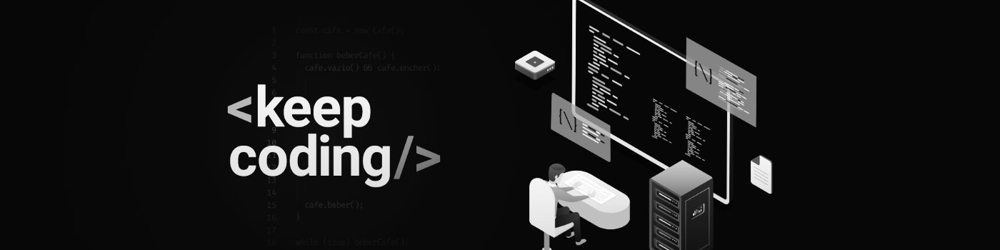

  
  <h1>Felipe Borges</h1>
	
										        

## 👨‍💻 Who am I?
A computer science, technology, games, movies, series, books and music lover.

## 💼 What am I currently working on?
As a Management Assistant at Prefeitura Municipal de São José dos Campos since September 2018. My assignments:
- Customer Service: Contact with a diverse audience, from different social classes and needs.
- Tasks Automation: Digital procedures that were done manually were automated by creating programs using JavaScript, Python, VBA and Auto Hotkey.
- Problem Solving: Several types of audience requests, and barriers of a system public. Troubleshooting is routine.

## 📖 And what am I learning?
- Web Development: I completed, on July, the GoStack Bootcamp of Rocketseat. We use NodeJS, ReactJS, and React Native and them whole ecosystem, from zero to deployment. And I am almost completing CS50x of Harvard University, that covers concepts like abstraction, algorithms, data structures, encapsulation, resource management, security, and software engineering, using various languages, including C, Python, SQL, and JavaScript. Besides that, I am currently studyig Profissional DevOps of IGTI. A Bootcamp that approaches most used fundamental concepts, practices, and tools in DevOps movement.
- Production Engineering: I am in the last semester of graduation at ETEP Faculdades in São José dos Campos, SP.

## 📞 How to reach me?

&nbsp

&nbsp

&nbsp

<!-- Pendencies
- [ ] - Add badges
- [ ] - Add a Summary
- [ ] - I’m looking to collaborate on...
- [ ] - I’m looking for help with...
-->
